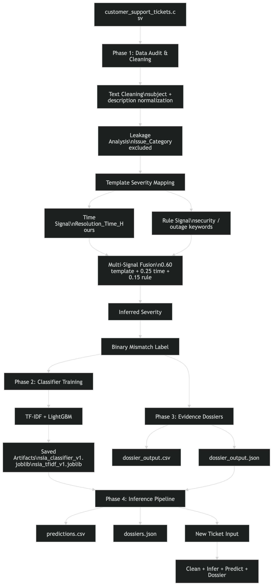

# Support Integrity Auditor (SIA)

**Project:** MARS Open Project 2026  

---

## Overview

Support Integrity Auditor (SIA) detects inconsistencies between customer support ticket content and the priority levels assigned to them. In practice, support queues frequently contain two classes of error: critical issues that have been downplayed by whoever triaged the ticket ("Hidden Crisis"), and minor issues that have been escalated beyond their actual severity ("False Alarm"). SIA surfaces both.

The project does not rely on a labelled ground-truth dataset of mismatches. Instead, it builds a multi-signal fusion score that infers what severity a ticket *should* be, then compares that inference against the assigned `Priority_Level`. Tickets where the two disagree are flagged, explained, and exported as structured evidence dossiers.

---

## Project Structure

```
.
├── README.md
├── Mars_open_project_2026.pdf          # Original project statement
├── SIA_final.ipynb                     # Complete project notebook
├── train_pipeline.py                   # Model training pipeline
├── predict.py                          # Batch inference pipeline
├── streamlit_app.py                    # Interactive dashboard
├── requirements.txt                    # Project dependencies

├── customer_support_tickets.csv        # Input dataset
├── enhanced_customer_support_data.csv  # Processed/enhanced dataset
├── adversarial_test_cases.csv          # Stress testing dataset

├── architecture.png                    # System architecture diagram
└── adversarial_evaluation.md           # Adversarial testing results

```

## Architecture

The Support Integrity Auditor processes customer support tickets through four stages: severity inference, mismatch detection, evidence dossier generation, and inference.



*Figure 1. End-to-end architecture of the Support Integrity Auditor.*

---

## Phases

The notebook is organized into four phases that run sequentially. The packaged scripts cover Phases 1–2 (training) and Phases 3–4 (inference and dossier generation).

### Phase 1 — Data Audit, Preprocessing, and Pseudo-Label Generation

Loads `customer_support_tickets.csv`, performs text cleaning, runs a leakage analysis on `Issue_Category`, then generates severity labels using a three-signal fusion approach:

- **Template signal (weight: 0.60):** The cleaned ticket subject is matched against a manually curated lookup table that maps 26 known subject templates to one of four severity levels (Low / Medium / High / Critical). This works because the source dataset is synthetically generated and subjects follow fixed templates.
- **Time signal (weight: 0.25):** `Resolution_Time_Hours` is ranked percentile-wise across the full dataset and binned into four severity buckets. Tickets resolved faster tend to be higher-severity (urgent tickets are prioritized).
- **Rule signal (weight: 0.15):** A simple keyword scan checks for security-related terms (`compromised`, `hacked`, `stolen`, `suspicious`, `fraud`) and outage-related terms (`crash`, `error`, `spinning wheel`, `not loading`, `failing`).

The fused score is rounded and clipped to `[0, 3]` to produce `inferred_severity_num`. Tickets where this value does not match `Priority_Level` are flagged as mismatches and typed as either `Hidden Crisis (Under-prioritized)` or `False Alarm (Over-prioritized)`.

**Leakage finding:** `Issue_Category` was found to be perfectly correlated with `Priority_Level` in the synthetic data. It is excluded from all model training features.

**Outputs:** `sia_pseudo_labeled_v3.csv`

### Phase 2 — Classifier Training

Trains a severity classifier on the pseudo-labeled dataset. Features are 1,000-dimensional TF-IDF vectors from `text_combined` (cleaned subject + first sentence of description), combined with `Resolution_Time_Hours` as a single numerical feature.

LightGBM (`LGBMClassifier`) is used when available. If not installed, the pipeline falls back to scikit-learn's `GradientBoostingClassifier` with equivalent hyperparameters. The data is split 70/15/15 (train/val/test) with stratification.

**Outputs:** `sia_classifier_v1.joblib`, `sia_tfidf_v1.joblib`, `confusion_matrix.png`, `feature_importance.png`

### Phase 3 — Evidence Dossier Generation

For every ticket identified as a mismatch, Phase 3 produces a structured evidence dossier. Each dossier contains:

- `ticket_id`, `assigned_priority`, `inferred_severity`, `mismatch_type`
- `severity_delta`: signed integer difference between inferred and assigned severity levels
- `feature_evidence`: list of evidence items, each with `source`, `value`, and `impact`
- `constraint_analysis`: a short, factual text explanation of the mismatch
- `confidence`: a three-component score (classifier probability × 0.50 + signal agreement × 0.30 + delta weight × 0.20)

Ten evidence extractors cover: security keywords, outage keywords, billing keywords, account-management keywords, subject template match, template mapping, resolution time signal, rule signal, fusion score, and classifier confidence. Every evidence item is traced directly to a ticket field or computed signal — no values are invented.

A six-rule validation suite runs on every generated dossier before export, checking for missing fields, null values, out-of-range confidence, empty evidence lists, delta integrity, and mismatch type consistency.

**Outputs:** `dossier_output.csv`, `dossier_output.json`

### Phase 4 — Inference Pipeline

Implements `predict_single_ticket()` and `predict_dataframe()` for new, unseen tickets. The pipeline reuses all Phase 3 logic without retraining. For inference, `Resolution_Time_Hours` is defaulted to 24.0 (a median assumption) since resolution time is not available at ticket-open time.

Required input fields: `Ticket_ID`, `Ticket_Subject`, `Ticket_Description`, `Priority_Level`.  
Optional: `Customer_Email` (used to derive `customer_tier` for the dossier context).

**Outputs:** `predictions.csv`, `dossiers.json`

---

## Setup

**Python 3.9+ is required.**

```bash
pip install -r requirements.txt
```

LightGBM is listed as optional. The pipeline detects its availability at runtime and falls back to `GradientBoostingClassifier` if it is not installed. Both paths produce the same output schema.

---

## Ablation Study

The severity inference pipeline combines three independent signals:

| Signal | Purpose | Weight |
|----------|----------|----------|
| Template Match | Maps known ticket templates to severity levels | 0.60 |
| Resolution Time Signal | Uses resolution duration as an indirect severity proxy | 0.25 |
| Rule-Based NLP Signal | Detects security, fraud, outage, and escalation indicators | 0.15 |

### Fusion Rationale

The synthetic CRM dataset follows highly structured ticket templates, making template matching the strongest severity indicator. Resolution time provides additional behavioral evidence and helps distinguish tickets with similar wording but different operational impact. Rule-based signals contribute targeted detection of critical security and outage patterns that may not be fully captured by template mappings alone.

The final inferred severity is computed as a weighted fusion of these three signals. This design was chosen because it produced more stable severity assignments than any individual signal used in isolation while remaining fully interpretable and traceable.

## Running the Pipeline

### Step 1: Train

Place `customer_support_tickets.csv` in the working directory, then run:

```bash
python train_pipeline.py
```

This will:
- Preprocess the dataset and generate pseudo-labels
- Export `sia_pseudo_labeled_v3.csv`
- Train the classifier and export `sia_classifier_v1.joblib` and `sia_tfidf_v1.joblib`
- Save `confusion_matrix.png` and `feature_importance.png`

### Step 2: Predict (batch)

Prepare a CSV with the required columns, then run:

```bash
python predict.py your_tickets.csv
```

This will:
- Load the saved model artifacts
- Run inference on all rows
- Export `predictions.csv` (summary) and `dossiers.json` (full dossiers)
- Print a dossier validation report

### Step 3: Predict (single ticket, programmatic)

```python
from predict import load_artifacts, predict_single_ticket, format_human_result

clf, tfidf = load_artifacts()

ticket = {
    "Ticket_ID": "TKT-001",
    "Ticket_Subject": "account hacked and stolen card",
    "Ticket_Description": "My account was compromised. Suspicious login detected.",
    "Priority_Level": "Low"
}

dossier = predict_single_ticket(ticket, clf, tfidf)
print(format_human_result(dossier))
```

---

## Key Design Decisions

**Why pseudo-labels instead of manual annotation?**  
The source dataset is synthetically generated with structured subject templates. This means the subject field contains deterministic signals about intended severity, making template-matching a reliable labeling strategy without requiring human annotators.

**Why is `Issue_Category` excluded?**  
A cross-tabulation during Phase 1 confirmed that `Issue_Category` (e.g., "Fraud") is near-perfectly correlated with `Priority_Level` in this dataset. Including it would constitute label leakage — the model would effectively memorize `Priority_Level` through a proxy rather than learning from ticket content.

**Why is resolution time in the fusion score but also used as a model feature?**  
Resolution time contributes to the *label* (via the time signal in the fusion score) and to the *model features* (as a raw numerical column). This is a deliberate design choice documented in the notebook. In a real deployment where resolution time is unavailable at ticket-open time, the inference pipeline defaults it to 24.0 and the effect on classification is minimal given the feature weight structure.

**Why TF-IDF over embeddings?**  
The dataset is template-based synthetic text. The subject field contains short, fixed phrases. TF-IDF with 1,000 features is sufficient to distinguish between them and produces a fully interpretable feature importance chart. Embeddings would add inference cost and model opacity without meaningful accuracy gain on this data.

## Known Limitations

- The dataset is synthetic and template-driven, so the pipeline benefits from structured subject patterns more than a fully natural support corpus.
- `Resolution_Time_Hours` is not available at ticket creation time, so inference uses a neutral default value for compatibility with the trained pipeline.
- The severity inference stage uses manually defined templates and rule-based signals, which makes the system explainable but also dependent on the quality of those handcrafted mappings.
- The classifier should be interpreted together with the leakage audit findings, since some columns in the source data are strongly correlated with priority and were excluded from training.
---


## Reproducibility

All random seeds are set to `42` at the top of both scripts and in the notebook. The dossier generation phase (Phase 3) is fully deterministic — no randomness is introduced after the classifier fallback training, which is also seeded. Running `train_pipeline.py` on the same input data will produce identical outputs on every run.
